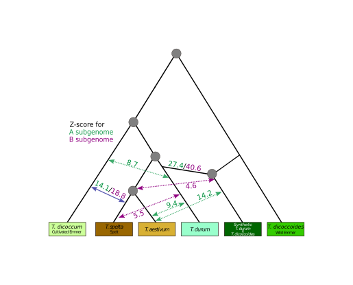

# Inference of Hybridization and Introgression Events using ABBA-BABA (Figure 4)

Author: [Michael Seidel](mailto:michael.seidel@helmholtz-muenchen.de)

## Basis for Figures and Tables
* Figure 4B
* Figure S12

## Usage

The script [angsd_sge.py](angsd_sge.py) is designed to be executed in a grid scheduling environment (like SGE). A command line for submission is presented upon execution.
The script expects one mandatory parameter to choose the grouping by `chromosome`, `subgenome` or `both`.

Additional files are required by `angsd`, please refer to the documentation of [ANGSD](http://www.popgen.dk/angsd/index.php/Abbababa2) for more details. Samples for both files are included in this repository for your reference.

## Input:

* [bamfiles.list](bamfiles.list.sample)
  A list of all samples that should be included in the analysis
* [sizeFile.size](sizeFile.size.sample)
  The number of lines in the bamfile that form one group, e.g. lines 1-5 are group A, lines 6-10 group B and lines 11-20 group C, then the sizes are 5, 5 and 10.

## Output:

The `angsd` generates output files with extension:

* `.result.Observed.txt`
D-statistic calculated WITHOUT Error Correction and WITHOUT Ancient Transition removal (from the ANGSD website)

* `.result.TransRem.txt`
D-statistic calculated WITHOUT Error Correction and WITH Ancient Transition removal (from the ANGSD website)
This output was used for the subsequent analyses.

## Code:
1. [angsd_sge.py](angsd_sge.py)

## External software (beyond imported packages):
1. [ANGSD](https://github.com/ANGSD/angsd)
