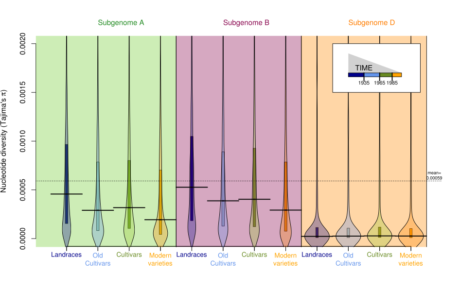
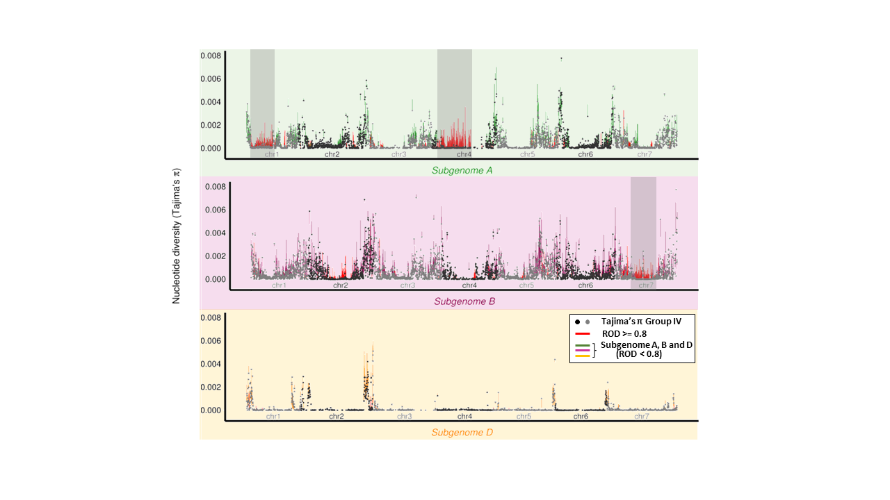

# Computation of nucleotide diversity π (Figure 3)

Author: [Thibault Leroy](mailto:thibault.leroy@umontpellier.fr)




## Basis for Figures and Tables
* Figure 3 A and B
* Figure S7


This directory comprises the code for seq-stat, a software used to compute several metrics, including
[nucleotide diversity π](https://en.wikipedia.org/wiki/Nucleotide_diversity) [1-3] over non-overlapping sliding windows, more information about `seq-stat` can be found on a recent publication about [avian sex chromosome evolution](https://www.biorxiv.org/content/early/2018/12/26/505610.full.pdf+html) [4].

Tajima’s nucleotide diversity π [1-3] was used to compute reduction of diversity (ROD) metricswhich helped identify regions bearing traces of recent selection by breeders.


## Installation

To work properly, `seq-stat` requires the installation of the [Bio++ library](http://biopp.univ-montp2.fr/) [5].

To compile `seq-stat`, use the command:

```bash 
g++ -std=c++14  -g seq_stat.cpp -o seq_stat  -I$HOME/local/bpp/dev/include/ -L$HOME/local/bpp/dev/lib/ -DVIRTUAL_COV=yes -Wall -lbpp-seq -lbpp-core -lbpp-popgen
```

## Input
[PHYLIP](https://en.wikipedia.org/wiki/PHYLIP) or [FASTA](https://en.wikipedia.org/wiki/FASTA_format) formatted multiple sequence alignment file containing the sequence of interest.


## Output
File containing information about the alignments diversity, including nucleotide diversity π [1-3], Watterson's estimator of genetic diversity ϴ [6] and Tajima's D [7].

## References
1. [Nei M. and Li W. H.: Mathematical model for studying genetic variation in terms of restriction endonucleases. Proc Natl Acad Sci U S A. 1979 Oct; 76(10): 5269-5273.](https://www.ncbi.nlm.nih.gov/pmc/articles/PMC413122/)
2. [Nei M. and Tajima F.: DNA Polymorphism Detectable by Restriction Endonucleases. Genetics. 1981 Jan; 97(1): 145-163.](https://www.ncbi.nlm.nih.gov/pmc/articles/PMC1214380/)
3. [Tajima F.:Evolutionary Relationship of DNA Sequences in Finite Populations. Genetics. 1983 Oct; 105(2): 437-460.](https://www.ncbi.nlm.nih.gov/pmc/articles/PMC1202167/)
4. [Leroy T., et al; A bird's white-eye shot: looking down on a new avian sex chromosome evolution, bioRxviv, doi: 10.1101/505610](https://doi.org/10.1101/505610)
5. [Guéguen L., et al ; Bio++: Efficient Extensible Libraries and Tools for Computational Molecular Evolution, Molecular Biology and Evolution, Volume 30, Issue 8, 1 August 2013, Pages 1745–1750](https://doi.org/10.1093/molbev/mst097)
6. [Watterson, G.A.: On the number of segregating sites in genetical models without recombination. Theoretical Population Biology. 1975, 7 (2): 256-276.](https://doi.org/10.1016%2F0040-5809%2875%2990020-9)
7. [Tajima, F.: Statistical method for testing the neutral mutation hypothesis by DNA polymorphism. Genetics. 1989. 123 (3): 585-95.](https://www.ncbi.nlm.nih.gov/pmc/articles/PMC1203831)
