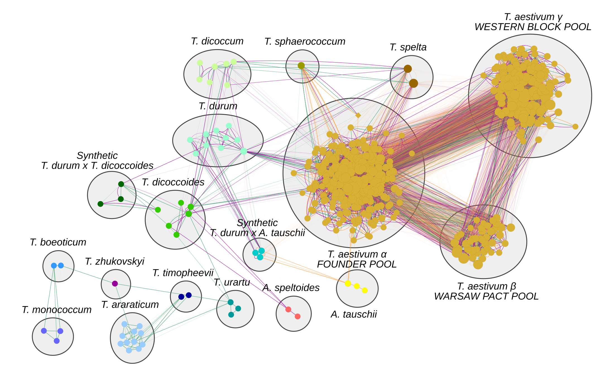

# Studying the Phylogeny and Reticulate Evolution of the Wheat Species Complex using Repeated Random Haplotype Sampling (RRHS) (Figure 4)

Author: [Daniel Lang](mailto:Daniel.Lang@helmholtz-muenchen.de)



This directory comprises a set of jupyter notebooks, snakemake workflows and scripts that were utilized to perform the phylogenetic analyses underlying the model of reticulate evolution in the wheat species complex.

## Basis for Figures and Tables
* Figure 4
* Figure S10
* Table S7 (manuscript version comprises only MST edges - full version as [tsv](RRHS_RAxML/Consensus_network.1000_RAxML.all_genomes.annotated.tsv) and [xlsx](RRHS_RAxML/Consensus_network.1000_RAxML.all_genomes.annotated.xlsx))
* Figure S11
* Figure S13

## Workflow
* [1. SNP filtering and export as multiple alignments using IUPAC ambiguity and RRHS for heterozygous sites](#1-snp-filtering-and-export-as-multiple-alignments-using-iupac-ambiguity-and-rrhs-for-heterozygous-sites)
* [2. Phylogenetic inference of maximum likelihood trees for the IUPAC alignments](#2-phylogenetic-inference-of-maximum-likelihood-trees-for-the-iupac-alignments)
* [3. Phylogenetic inference of maximum likelihood trees for the 1000 RRHS samples](#3-phylogenetic-inference-of-maximum-likelihood-trees-for-the-1000-rrhs-samples)
* [4. Inferring consensus topologies for the 1000 RRHS trees using RAxML](#4-inferring-consensus-topologies-for-the-1000-rrhs-trees-using-raxml)
* [5. Inferring consensus topologies for the 1000 RRHS trees using ASTRAL](#5-inferring-consensus-topologies-for-the-1000-rrhs-trees-using-astral)
* [6. Inference of a Phylogenetic Consensus Network from RRHS trees](#6-inference-of-a-phylogenetic-consensus-network-from-rrhs-trees)
* [7. Analysis of the Phylogenetic Consensus Network and Taxon-Community Clusters](#7-analysis-of-the-phylogenetic-consensus-network-and-taxon-community-clusters)
* [8. Plotting Trees as Phylograms and Cloudogram/Densitrees](#8-plotting-trees-as-phylograms-and-cloudogramdensitrees)
* [9. Checking dominant genotype and introgressions in <em>durum x dicoccoides</em> RIL lines](#9-checking-dominant-genotype-and-introgressions-in-durum-x-dicoccoides-ril-lines)

### 1. SNP filtering and export as multiple alignments using IUPAC ambiguity and RRHS for heterozygous sites
A summary of the overall SNP filtering process is also provided as [LibreOffice calc sheet](SNP_stats.ods).
## Input:
1. Unimputed variant calls in VCF split by chromosome (e.g. `full_vcfs/chr1A.minocc10.maf1pc.vcf`)
2. [Genotype Metadata](Whealbi_500samples_table.xlsx)

## Output:
1. Variant call data structures in [HDF5](https://en.wikipedia.org/wiki/Hierarchical_Data_Format)
2. Multiple sequence alignments with heterozygous sites as [IUPAC ambiguity symbols](https://en.wikipedia.org/wiki/Nucleic_acid_notation#IUPAC_notation) ([FASTA](https://en.wikipedia.org/wiki/FASTA_format))
	1. 3 subgenomes (B, A, D)
	2. 3 x 7 chromosomes (1B-7B, 1A-7A, 1D-7D)
3. 1000 Multiple sequence alignments with heterozygous sites randomly selected by RRHS ([FASTA](https://en.wikipedia.org/wiki/FASTA_format))
4. Filtered VCF files ([VCF](https://en.wikipedia.org/wiki/Variant_Call_Format))
5. Diverse exploratory plots ([PDF](https://en.wikipedia.org/wiki/PDF))

#### Code:
1. [FilterSNPsNGetAlignments.ipynb](FilterSNPsNGetAlignments.ipynb)

#### Parametric details: 
Applied filtering criteria (in order of application):
1. Only SNPs
2. Maximally missing in 10% of the genotypes
3. Biallelic
4. Alternative allele must be present in >1 genotype
5. LD Pruning ([scikit.allele.locate_unlinked](https://scikit-allel.readthedocs.io/en/latest/stats/ld.html)): 
	* `allele.locate_unlinked(gn, size=window_size, step=step_size, threshold=threshold)`
	* window size = 500bp
	* step size = 200bp
	* threshold = 0.1
6. Polymorphic sites

### 2. Phylogenetic inference of maximum likelihood trees for the IUPAC alignments
#### Input:
1. Multiple sequence alignments with heterozygous sites as [IUPAC ambiguity symbols](https://en.wikipedia.org/wiki/Nucleic_acid_notation#IUPAC_notation) ([FASTA](https://en.wikipedia.org/wiki/FASTA_format))
	1. 3 subgenomes (B, A, D)
	2. 3 x 7 chromosomes (1B-7B, 1A-7A, 1D-7D)
#### Output:
1. Phylogenetic trees ([NEWICK](https://en.wikipedia.org/wiki/Newick_format)):
	1. `iupac/A/RAxML_bestTree.ASC_GTRGAMMA_felsenstein`
	2. `iupac/A_chromosomes/RAxML_bestTree.chr1A.ASC_GTRGAMMA_felsenstein`
2. automatically generated configuration files as input for RAxML 
3. other files reported by RAxML
#### Code:
1. [iupac/Snakefile.raxml](iupac/Snakefile.raxml)
2. [iupac/Snakefile.raxml_chr](iupac/Snakefile.raxml_chr)

#### External software (beyond imported packages):
1. [RAxML](https://cme.h-its.org/exelixis/web/software/raxml/index.html)

#### Parametric details: 
* `-m ASC_GTRGAMMA --JC69 --asc-corr=felsenstein`
* total size to relate ascertainment bias: 44746258 &#x2192; present in 95% of the subgenome-specific samples on median
* 12 and 4 threads respectively

#### Additional syntax:
```Bash
#cluster submission
snakemake --snakefile Snakefile.raxml --cluster 'qsub -q QUEUENAME -V -cwd -e log/ -o log/ -pe serial {threads} -l job_mem=2G' -j 100 -w 500
snakemake --snakefile Snakefile.raxml_chr --cluster 'qsub -q QUEUENAME -V -cwd -e log/ -o log/ -pe serial {threads} -l job_mem=2G' -j 100 -w 500
```

### 3. Phylogenetic inference of maximum likelihood trees for the 1000 RRHS samples
#### Input:
1. 1000 Multiple sequence alignments with heterozygous sites randomly selected by RRHS ([FASTA](https://en.wikipedia.org/wiki/FASTA_format))
#### Output:
1. 1000 Phylogenetic trees ([NEWICK](https://en.wikipedia.org/wiki/Newick_format)) e.g. `RRHS_RAxML/output/RAxML_bestTree.ASC_GTRGAMMA_felsenstein.A.1`
2. automatically generated configuration files as input for RAxML 
3. other files reported by RAxML

#### Code:
1. [RRHS_RAxML/Snakefile](RRHS_RAxML/Snakefile)

#### External software (beyond imported packages):
1. [RAxML](https://cme.h-its.org/exelixis/web/software/raxml/index.html)

#### Parametric details: 
* `-m ASC_GTRGAMMA --JC69 --asc-corr=felsenstein`
* total size to relate ascertainment bias: 44746258 &#x2192; present in 95% of the subgenome-specific samples on median
* 10 threads
* per core memory: 2GB

#### Additional syntax:
```Bash
#cluster submission
snakemake --cluster 'qsub -q QUEUENAME -e {log.err} -o {log.out} -cwd -pe serial {threads} -l job_mem={params.mem}' -j 500 -w 500
```

### 4. Inferring consensus topologies for the 1000 RRHS trees using RAxML
#### Input:
1. 1000 Phylogenetic trees ([NEWICK](https://en.wikipedia.org/wiki/Newick_format)) e.g. `RRHS_RAxML/output/RAxML_bestTree.ASC_GTRGAMMA_felsenstein.A.1`
#### Output:
1. Consensus topologies with support values ([NEWICK](https://en.wikipedia.org/wiki/Newick_format); e.g. `RAxML_MajorityRuleConsensusTree.ASC_GTRGAMMA_felsenstein.A.RRHS_consensus.MR`) with 4 methods: 
	1. MajorityRuleExtendedConsensusTree
	2. MajorityRuleConsensusTree 
	3. StrictConsensusTree
	4. Threshold-75-ConsensusTree
2. other files reported by RAxML

#### Code:
1. [RRHS_RAxML/Snakefile.consensu](RRHS_RAxML/Snakefile.consensu)

#### External software (beyond imported packages):
1. [RAxML](https://cme.h-its.org/exelixis/web/software/raxml/index.html)

#### Parametric details: 
* `-m ASC_GTRGAMMA `
* 20 threads

#### Additional syntax:
```Bash
cd RRHS_RAxML/
snakemake --snakefile Snakefile.consensu 
```

### 5. Inferring consensus topologies for the 1000 RRHS trees using ASTRAL 
Gratefully following the advise and suggestions by ASTRAL developer [Siavash Mirarab](https://github.com/smirarab):  
https://github.com/smirarab/ASTRAL/issues/38

#### Input:
1. 1000 Phylogenetic trees ([NEWICK](https://en.wikipedia.org/wiki/Newick_format)) e.g. `RRHS_RAxML/output/RAxML_bestTree.ASC_GTRGAMMA_felsenstein.A.1`
#### Output:
1. Consensus topologies with quartet values ([NEWICK](https://en.wikipedia.org/wiki/Newick_format)) e.g. `RAxML_bestTree.ASC_GTRGAMMA_felsenstein.A.astral.quartets.nh`

#### Code:
1. [RRHS_RAxML/Snakefile.ASTRALL-II](RRHS_RAxML/Snakefile.ASTRALL-II)

#### External software (beyond imported packages):
1. [ASTRAL 4.10.12](https://github.com/smirarab/ASTRAL)

#### Parametric details: 
* `-t 1 `

#### Additional syntax:
```Bash
cd RRHS_RAxML/
snakemake --snakefile Snakefile.ASTRAL-II
```

### 6. Inference of a Phylogenetic Consensus Network from RRHS trees
This procedure:
1. foreach subgenome, infers the [minimum spanning tree](https://networkx.github.io/documentation/stable/reference/algorithms/generated/networkx.algorithms.tree.mst.minimum_spanning_tree.html) tip graph for each RRHS tree using the phylogenetic distance as weight &#x2192; `mst_trees` 
2. foreach subgenome, merges them each into a weighted graph using the inverse of the relative number of `mst_trees` sharing an edge as a weight &#x2192; `G` 
3. infers the [minimum spanning tree](https://networkx.github.io/documentation/stable/reference/algorithms/generated/networkx.algorithms.tree.mst.minimum_spanning_tree.html) graph of `G` &#x2192; `GM` (MST edges)
4. merges all subgenome graphs `G` into a combined graph with annotated MST edges 

Subsequently, the graph was imported into [Cytoscape](https://cytoscape.org), community clustering was performed using the [Newmann-Girvan algorithm](https://en.wikipedia.org/wiki/Girvan%E2%80%93Newman_algorithm) implemented in the [ClusterMaker2 plugin](http://www.rbvi.ucsf.edu/cytoscape/clusterMaker2/), the resulting clusters were intersected with taxonomic information and annotated with the [AutoAnnotate plugin](https://doi.org/10.12688/f1000research.9090.1). 

#### Input:
1. 1000 Phylogenetic trees ([NEWICK](https://en.wikipedia.org/wiki/Newick_format)) e.g. `RRHS_RAxML/output/RAxML_bestTree.ASC_GTRGAMMA_felsenstein.A.1`
2. [Genotype Metadata](Whealbi_500samples_table.xlsx)
#### Output:
1. Weighted phylogenetic consensus network for each subgenome (B, A, D) `G`
2. Minimal phylogenetic consensus network for each subgenome (B, A, D) `GM` 
3. Combined, annotated, weighted phylogenetic consensus network comprising all subgenomes (B, A, D) &#x2192; [Figure4A](RRHS_RAxML/Figure/Figure4A.png), [FigureS10](RRHS_RAxML/Figure/FigureS10.png) and Table S4 (manuscript version comprises only MST edges - full version as [tsv](RRHS_RAxML/Consensus_network.1000_RAxML.all_genomes.annotated.tsv) and [xlsx](RRHS_RAxML/Consensus_network.1000_RAxML.all_genomes.annotated.xlsx))

The [phylogenetic taxon-community clusters](RRHS_RAxML/Network.Clusters.nodes.csv) were exported from Cytoscape. 

#### Code:
1. [RRHS_RAxML/GetNetwork.B.ipynb](RRHS_RAxML/GetNetwork.B.ipynb)
2. [RRHS_RAxML/GetNetwork.A.ipynb](RRHS_RAxML/GetNetwork.A.ipynb)
3. [RRHS_RAxML/GetNetwork.D.ipynb](RRHS_RAxML/GetNetwork.D.ipynb)
4. [RRHS_RAxML/MergeSubgenomeNetworks.ipynb](RRHS_RAxML/MergeSubgenomeNetworks.ipynb)

#### Parametric details: 
* 20 threads

### 7. Analysis of the Phylogenetic Consensus Network and Taxon-Community Clusters
Indepth statistical analysis of the Taxon-Comunity clusters' composition and the relationships between the 3 bread wheat communities. 

#### Input:
1. Node annotation [RRHS_RAxML/Network.Clusters.nodes.csv](RRHS_RAxML/Network.Clusters.nodes.csv)
2. [Country Codes](curate.codes.txt)
3. [RRHS_RAxML/Consensus_network.1000_RAxML.all_genomes.tsv](RRHS_RAxML/Consensus_network.1000_RAxML.all_genomes.annotated.tsv)
#### Output:
1. Country annotated nodes of the [phylogenetic community-taxon clusters](RRHS_RAxML/PhylogeneticClusters.csv) 
2. Country factors used in the analyses as [tsv](countries.tsv) and [xlsx](countries.xlsx) (latter was manually curated)
3. Several exploratory plots some of which ended up as panels in Figure S13 (in notebook and [PDF](https://en.wikipedia.org/wiki/PDF))

#### Code:
1. [RRHS_RAxML/TestClusters.ipynb](RRHS_RAxML/TestClusters.ipynb)

### 8. Plotting Trees as Phylograms and Cloudogram/Densitrees
#### Input:
1. Tree files in [NEWICK](https://en.wikipedia.org/wiki/Newick_format) from the [IUPAC](iupac/) and [RRHS](RRHS_RAxML/) RAxML analyses
2. [Genotype Metadata](Whealbi_500samples_table.xlsx)
3. [Taxon-Comunity cluster colors](RRHS_RAxML/TaxonCluster.colors.tsv)
4. Country annotated nodes of the [phylogenetic community-taxon clusters](RRHS_RAxML/PhylogeneticClusters.curated.xlsx) 

#### Output:
1. Several tree plots in the notebook
2. Annotated versions of the trees

#### Code:
1. [RRHS_RAxML/PlotTrees.ipynb](RRHS_RAxML/PlotTrees.ipynb)
2. [RRHS_RAxML/PlotTrees-Part2.ipynb](RRHS_RAxML/PlotTrees-Part2.ipynb)
3. [RRHS_RAxML/PlotTrees-Astral.Communities.ipynb](RRHS_RAxML/PlotTrees-Astral.Communities.ipynb)

### 9. Checking dominant genotype and introgressions in _durum x dicoccoides_ RIL lines
This part of the analysis could be considered as something like blind study, as I was not aware that the genotypes taxon initally marked as *T. turgidum* actually were F6 RIL offspring from this study: 

[Ben-David et al 2008, Dissection of powdery mildew resistance uncover different resistance types in the *Triticum turgidum L.* gene pool. Conference: the 11th International Wheat Genetics Symposium](https://www.researchgate.net/publication/236735072_Dissection_of_powdery_mildew_resistance_uncover_different_resistance_types_in_the_Triticum_turgidum_L_gene_pool)

As they were identified as hybrids in our approach they served as an excellent showcase and proof-of-concept.

#### Input:
1. Multiple sequence alignments with heterozygous sites as [IUPAC ambiguity symbols](https://en.wikipedia.org/wiki/Nucleic_acid_notation#IUPAC_notation) ([FASTA](https://en.wikipedia.org/wiki/FASTA_format)) per chromosome
#### Output:
1. Various plots and tables in the notebook
#### Code:
1. [CheckRIL.ipynb](CheckRIL.ipynb)
