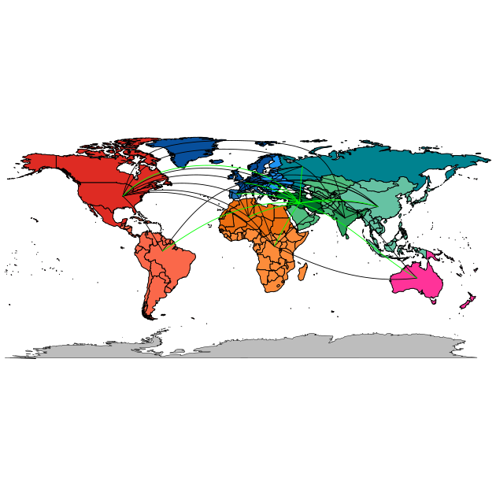

# Components of the panel structure (Figure 2B)

Author: [Wandrille Duchemin](mailto:wandrille.duchemin@inra.fr)



Code and data to simulate hexaploid wheat ancestral region of origin.
The results of these simulations have been used to build Figure 2B.

## Basis for Figures and Tables
* Figure 2B

## Workflow

### 1. Cropping the tree to remove individuals of unknown origin and non T.aestivum.

Python code:
```python
#UNK + spelta + shaerococcum
toPrune = ["WW040","WW066","WW105","WW159","WW170","WW171","WW246","WW248","WW259","WW266","WW240","WW241"]

from ete3 import Tree

tree = Tree("hexaploids.allGenes.fa.treefile.ann")

L = tree.get_leaf_names()
toKeep = [ n for n in L if not n in toPrune ]

tree.prune(toKeep)

OUT=open("Taestivum.allGenes.noUNKorigin.nwk","w")
OUT.write( tree.write() + "\n" )
OUT.close()
```

#### Input
* Hexaploid bread wheat [tree](hexaploids.allGenes.fa.treefile.ann)


#### Output
* Cropped hexaploid bread wheat [tree](Taestivum.allGenes.noUNKorigin.nwk)

### 2. Inference of Ancestral States

#### Code: 
* [estimate_ancestral_states.R](estimate_ancestral_states.R)

#### Input
* [geographical origin file](speciesOrigin.csv)
* [description file](../monophyly_permutation/Sup_487samples.csv) : containing growth habit and historical group information

#### Output
2 files containing the trees with simulated character and a summary of the simulations.

For example, for 10000 simulations of geographcal origin :
* `ancestral_simul.Region.10000.mtrees`
* `ancestral_simul.Region.10000.pd`


### 3. Analysis and Plots
The resulting simulations can be analysed and plotted with 

#### Code: 
* [plotAncestralTree_and_Map.R](plotAncestralTree_and_Map.R)
