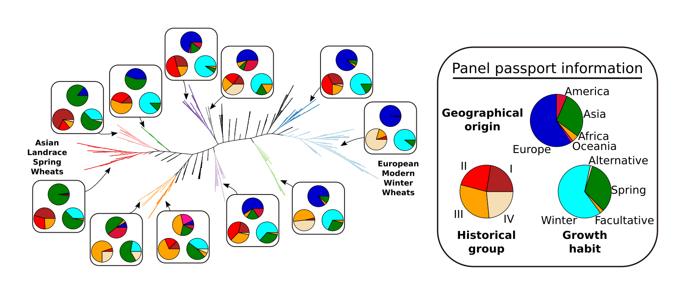

# Geographical component of the panel structure (Figure 2A)

Author: [Wandrille Duchemin](mailto:wandrille.duchemin@inra.fr)



Code and data for the permutation tests to test the grouping of three character : continent of origin, growth habit, and historical group.

## Basis for Figures and Tables
* Figure 2A

## Workflow
### 1. Extract clades 

script to list all clades in a tree
Code: 
 * [extract_all_clades.py](extract_all_clades.py) 

#### Input

 * hexaploid wheat phylogenetic tree ( eg. [this tree](../ancestral_region_simulations/hexaploids.allGenes.fa.treefile.ann) )

#### Output

prints to screen the list of clades in the unrooted tree.
One line per clade, leaf names separated by ";".

See [allHexaClades.txt](allHexaClades.txt).


### 2. Determining the most structuring character, using proportion of monophyletic clades and permutation tests

#### Input: 
1. Phylogenetic clades to test [allHexaClades.txt](allHexaClades.txt)
2. Genotype metadata [Sup_487samples.csv](Sup_487samples.csv)
3. Character trait i.e. name of the column to use as a trait from the second file: 
	* `"Growth habit"`
	* `Group`
	* `Continent`
4. Number of permutations
5. Filename to direct output to e.g. `allHexaClades.txt.Growth_habit.PermutsPmonophyletic.100`

#### Output:

Prints to screen the proportion of clades which are monophyletic for the given character in the original data, as well as the number (and proportion) of sampled permutations which show a higher proportion of monophyletic clades.
Also writes a file (e.g. `allHexaClades.txt.Growth_habit.PermutsPmonophyletic.100`) containing the proportions of monophyletic clades of the sampled permutations (1 floating number per line).


#### Code:
* [computeMonophyly.py](computeMonophyly.py)

Command example, `100` permutations for the `Growth Habit` character trait : 

```bash
python computeMonophyly.py allHexaClades.txt Sup_487samples.csv "Growth habit" 100 allHexaClades.txt.Growth_habit.PermutsPmonophyletic.100
```

prints to screen:

```
proportion of monophyletic :  0.31870669746
original data shows more monophyletic clades than 100.0 ( 1.0 ) permutations.
```

and creates a file named `allHexaClades.txt.Growth_habit.PermutsPmonophyletic.100` which contains 100 floating numbers.


#### Results

* Growth habit   : proportion of monophyletic :  0.31870669746
* Group          : proportion of monophyletic :  0.322748267898
* Continent      : proportion of monophyletic :  0.384526558891


We performed 10 000 000 permutations each for each character.

* `allHexaClades.txt.Growth_habit.PermutsPmonophyletic.txt.10M`
	no permutation with a proportion > 0.31870669746  -> p-value < 10-7
* `allHexaClades.txt.Group.PermutsPmonophyletic.txt.10M`
	no permutation with a proportion > 0.322748267898 -> p-value < 10-7
* `allHexaClades.txt.Continent.PermutsPmonophyletic.txt.10M`
	no permutation with a proportion > 0.384526558891 -> p-value < 10-7
